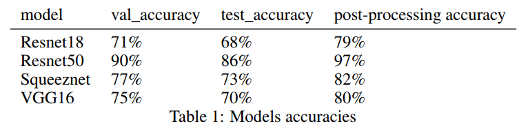

# Mauna-Kea-Challenge
# Overview
  The goal of this challenge is to build an image classifier to assist physicians in the screening and diagnosis of esophageal cancer. Such a tool would have a massive impact on patient management and patient lives.

# Dataset
  There are 11161 images acquired from 61 patients to be classified as: - Squamous Epithelium - Intestinal Metaplasia - Gastric Metaplasia - Dysplasia/Cancer. A detailed description of the dataset can be found in the PDF attached in supplementary materials. The order in which the predictions must be submitted can be found in the file test_order.csv in the supplementary material. The submission file should be a .cvs file with (N+1) lines (N = number of images in the test set, +1 = header) and 2 columns (1st column = im_XXX, 2nd column = class digit). A detailed description of the clinical criteria for each class in Cellvizio images is provided in the ANNEXE document. Data is provided under Creative Commons BY-NC-SA license.
 
<kbd></kbd>
 
# Method and Results
  In this project, we used pre-trained Convolutional Neural Networks (ResNet,VGG16 and squeezeNet) to classify medical images. We applied Data Augmentation techniques in order to prevent overfitting. After testing several models we selected ResNet50 which had the highest accuracy: 86% after 15 epochs. Lastly, we aggregated the predictions by patient_id and assigned the predominant class to the images of each patient. This pre-processing increased the accuracy from 86% to 97%. And by that we had the [4th place](https://challengedata.ens.fr/participants/challenges/11/ranking/public) in the public ranking of this challenge.

<kbd></kbd>
